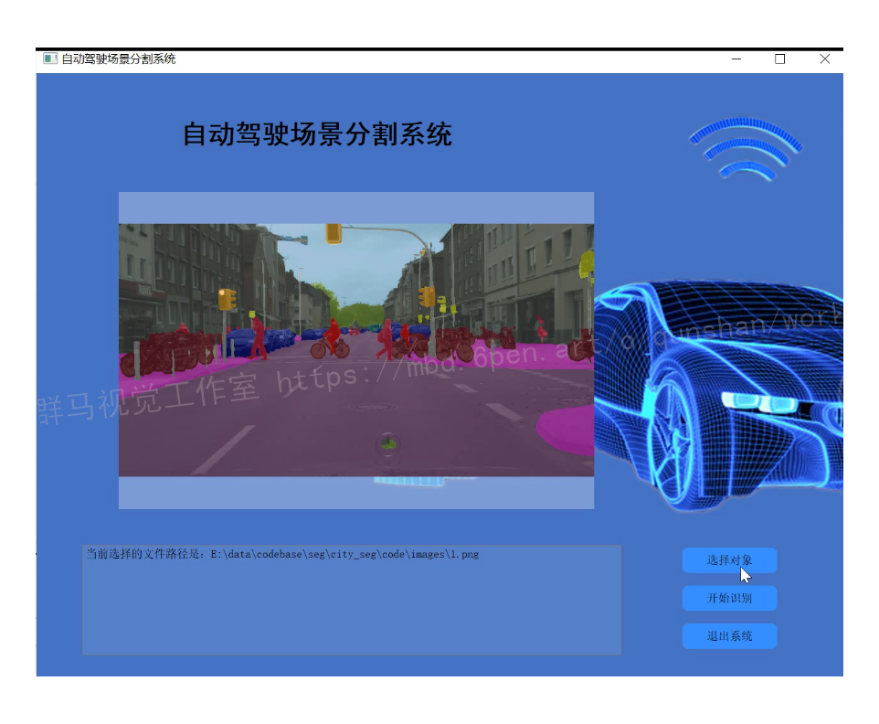
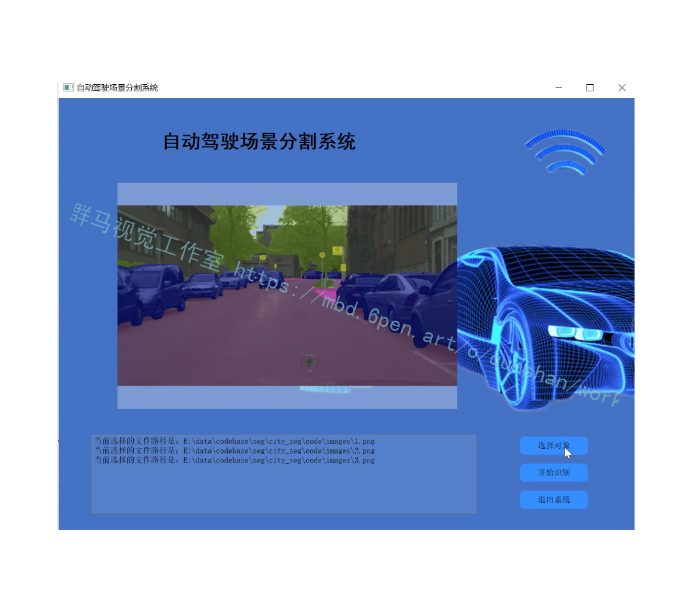
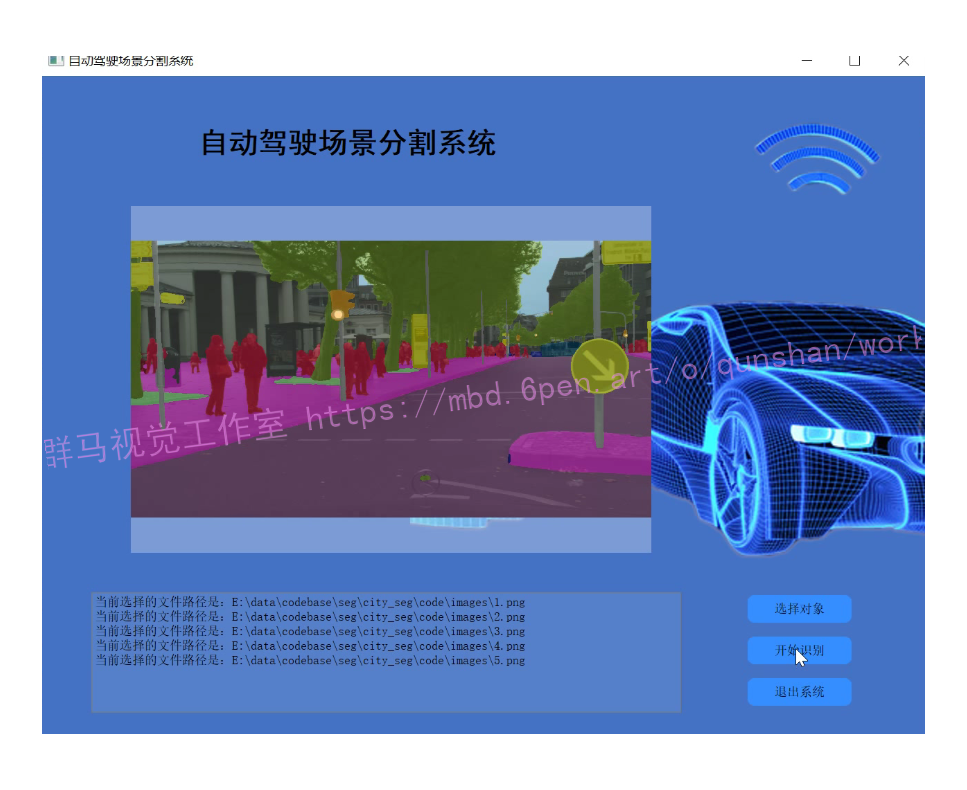
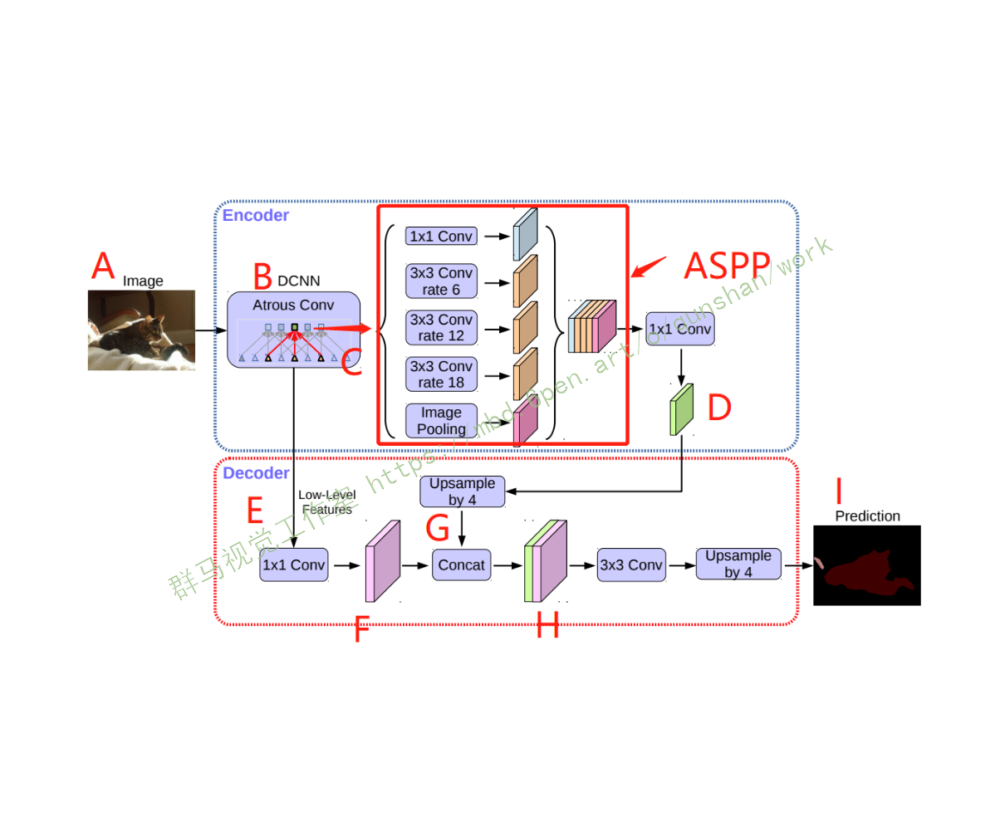
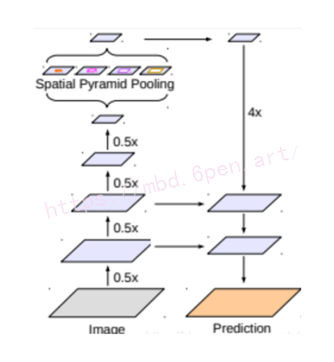
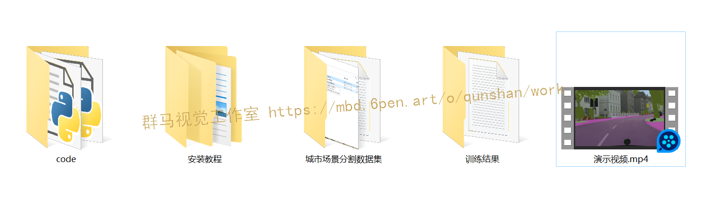

# 1.研究背景
随着人工智能技术的飞速发展，车辆的自动驾驶离人们的生活越来越近。自动驾驶整个运行流程中首先需要依赖各种车载传感器收集车辆周围的各种环境数据，进而利用各种分析算法分析得到计算机可感知的环境信息，然后利用感知到的信息指导车辆规划决策。然而目前车辆使用的激光雷达等传感器大多成本高昂，不利于自动驾驶车辆的大规模普及。相比较而言，摄像头成本低廉且可以获得大量的周围环境信息，因此，研究基于摄像头的自动驾驶感知算法具有重要的意义。
图像语义分割是自动驾驶感知中最重要的技术之一,利用图像语义分割的结果可以得到车辆的可行驶区域信息、前方障碍物信息等。在深度学习与卷积神经网络在近几年兴起之后，涌现了众多以深度学习为基础的图像语义分割算法，基本都能实现端到端的图像语义分割输出。但目前距离图像语义分割算法真正使用到自动驾驶系统中还存在着一些问题:
(1）许多算法不能实时运行，这无法满足安全性为主的自动驾驶的需求;
(2）自动驾驶场景中场景复杂、种类众多造成训练数据样本不均衡，许多算法对于小样本的检测效果不好。
因此自动驾驶城市场景的图像语义分割还存在许多问题需要解决,本文的研究重点是基于自动驾驶场景中的可实时的图像语义分割算法。

# 2.图片演示






# 3.视频演示
[基于改进Deeplabv3plus的自动驾驶场景分割系统 （源码＆教程）_哔哩哔哩_bilibili](https://www.bilibili.com/video/BV1wg411B7rG/?spm_id_from=333.999.0.0&vd_source=3ef7658e6f4d084cacbe1d1fd4f24d82)


# 4.Deeplabv3plus简介
DeepLabV3plus 是一个用于语义分割的模型，它提出了一种新的 encoder-decoder 结构，采用 DeepLabv3 作为编码器模块，并使用一个简单而有效的解码器模块。[该博客提出的模型](https://afdian.net/item?plan_id=f5bb6caa5a5211ed938552540025c377)可通过 atrous 卷积（空洞卷积）来控制所提取的编码器特征的分辨率，从而权衡精度和运行时间。此外，该网络还将 Xception 模型用于分割任务，并将 Depthwise Separable Convolution 应用于 ASPP 模块和解码器模块，从而得到更快更强的 encoder-decoder 网络。其网络结构如下：


# 5.改进方向
#### 替换backbone
[DeepLabV3+论文](https://mbd.pub/o/bread/Y5mUlJlp)里的backbone是Xception, 我下到的工程里用的是ResnetV2-50和ResnetV2-101。

整体的模型保存为PB有一百多M, 在CPU上的运行时间是1秒多。

为了加快网络速度，将backbone替换为MobileNetV2。

#### 使用深度分离卷积替换普通卷积
ASPP部分和decoder部分的参数数量同样吓人，为此把所有的普通卷积替换为深度分离卷积。

同时ASPP和decoder部分的通道数量也做了一定的删减。

#### 增加一次对底层特征的融合
在做身份证部件解析的时候发现细节切分效果较差。为了改善细节，将1/2大小的特征图和decoder特征进行融合，最终取得了不错的效果。
#### 改进后的网络结构


# 6.代码实现
```
from __future__ import absolute_import
from __future__ import division
from __future__ import print_function
import tensorflow as tf

from src.deeplabv3.nets.config import *
from src.deeplabv3.nets import resnet_utils
from src.deeplabv3.nets.resnet_v1 import bottleneck, resnet_arg_scope

slim = tf.contrib.slim

@slim.add_arg_scope
def bottleneck_hdc(inputs,
               depth,
               depth_bottleneck,
               stride,
               rate=1,
               multi_grid=(1,2,4),
               outputs_collections=None,
               scope=None,
               use_bounded_activations=False):
  """Hybrid Dilated Convolution Bottleneck.
  Multi_Grid = (1,2,4)
  See Understanding Convolution for Semantic Segmentation.
  When putting together two consecutive ResNet blocks that use this unit, one
  should use stride = 2 in the last unit of the first block.
  Args:
    inputs: A tensor of size [batch, height, width, channels].
    depth: The depth of the ResNet unit output.
    depth_bottleneck: The depth of the bottleneck layers.
    stride: The ResNet unit's stride. Determines the amount of downsampling of
      the units output compared to its input.
    rate: An integer, rate for atrous convolution.
    multi_grid: multi_grid sturcture.
    outputs_collections: Collection to add the ResNet unit output.
    scope: Optional variable_scope.
    use_bounded_activations: Whether or not to use bounded activations. Bounded
      activations better lend themselves to quantized inference.
  Returns:
    The ResNet unit's output.
  """
  with tf.variable_scope(scope, 'bottleneck_v1', [inputs]) as sc:
    depth_in = slim.utils.last_dimension(inputs.get_shape(), min_rank=4)
    if depth == depth_in:
      shortcut = resnet_utils.subsample(inputs, stride, 'shortcut')
    else:
      shortcut = slim.conv2d(
          inputs,
          depth, [1, 1],
          stride=stride,
          activation_fn=tf.nn.relu6 if use_bounded_activations else None,
          scope='shortcut')

    residual = slim.conv2d(inputs, depth_bottleneck, [1, 1], stride=1, 
      rate=rate*multi_grid[0], scope='conv1')
    residual = resnet_utils.conv2d_same(residual, depth_bottleneck, 3, stride,
      rate=rate*multi_grid[1], scope='conv2')
    residual = slim.conv2d(residual, depth, [1, 1], stride=1, 
      rate=rate*multi_grid[2], activation_fn=None, scope='conv3')

    if use_bounded_activations:
      # Use clip_by_value to simulate bandpass activation.
      residual = tf.clip_by_value(residual, -6.0, 6.0)
      output = tf.nn.relu6(shortcut + residual)
    else:
      output = tf.nn.relu(shortcut + residual)

    return slim.utils.collect_named_outputs(outputs_collections,
                                            sc.name,
                                            output)

def deeplabv3(inputs,
              num_classes,
              depth=50,
              aspp=True,
              reuse=None,
              is_training=True):
  """DeepLabV3
  Args:
    inputs: A tensor of size [batch, height, width, channels].
    depth: The number of layers of the ResNet.
    aspp: Whether to use ASPP module, if True, will use 4 blocks with 
      multi_grid=(1,2,4), if False, will use 7 blocks with multi_grid=(1,2,1).
    reuse: Whether or not the network and its variables should be reused. To be
      able to reuse 'scope' must be given.
  Returns:
    net: A rank-4 tensor of size [batch, height_out, width_out, channels_out].
    end_points: A dictionary from components of the network to the 
      corresponding activation.
  """
  if aspp:
    multi_grid = (1,2,4)
  else:
    multi_grid = (1,2,1)
  scope ='resnet{}'.format(depth)
  with tf.variable_scope(scope, [inputs], reuse=reuse) as sc:
    end_points_collection = sc.name + '_end_points'
    with slim.arg_scope(resnet_arg_scope(weight_decay=args.weight_decay, 
      batch_norm_decay=args.bn_weight_decay)):
      with slim.arg_scope([slim.conv2d, bottleneck, bottleneck_hdc],
                          outputs_collections=end_points_collection):
        with slim.arg_scope([slim.batch_norm], is_training=is_training):
          net = inputs
          net = resnet_utils.conv2d_same(net, 64, 7, stride=2, scope='conv1')
          net = slim.max_pool2d(net, [3, 3], stride=2, scope='pool1')

          with tf.variable_scope('block1', [net]) as sc:
            base_depth = 64
            for i in range(2):
              with tf.variable_scope('unit_%d' % (i + 1), values=[net]):
                net = bottleneck(net, depth=base_depth * 4, 
                  depth_bottleneck=base_depth, stride=1)
            with tf.variable_scope('unit_3', values=[net]):
              net = bottleneck(net, depth=base_depth * 4, 
                depth_bottleneck=base_depth, stride=2)
            net = slim.utils.collect_named_outputs(end_points_collection, 
              sc.name, net)

          with tf.variable_scope('block2', [net]) as sc:
            base_depth = 128
            for i in range(3):
              with tf.variable_scope('unit_%d' % (i + 1), values=[net]):
                net = bottleneck(net, depth=base_depth * 4, 
                  depth_bottleneck=base_depth, stride=1)
            with tf.variable_scope('unit_4', values=[net]):
              net = bottleneck(net, depth=base_depth * 4, 
                depth_bottleneck=base_depth, stride=2)
            net = slim.utils.collect_named_outputs(end_points_collection, 
              sc.name, net)

          with tf.variable_scope('block3', [net]) as sc:
            base_depth = 256

            num_units = 6
            if depth == 101:
              num_units = 23
            elif depth == 152:
              num_units = 36

            for i in range(num_units):
              with tf.variable_scope('unit_%d' % (i + 1), values=[net]):
                net = bottleneck(net, depth=base_depth * 4, 
                  depth_bottleneck=base_depth, stride=1)
            net = slim.utils.collect_named_outputs(end_points_collection, 
              sc.name, net)

          with tf.variable_scope('block4', [net]) as sc:
            base_depth = 512

            for i in range(3):
              with tf.variable_scope('unit_%d' % (i + 1), values=[net]):
                net = bottleneck_hdc(net, depth=base_depth * 4, 
                  depth_bottleneck=base_depth, stride=1, rate=2, 
                  multi_grid=multi_grid)
            net = slim.utils.collect_named_outputs(end_points_collection, 
              sc.name, net)

          if aspp:
            with tf.variable_scope('aspp', [net]) as sc:
              aspp_list = []
              branch_1 = slim.conv2d(net, 256, [1,1], stride=1, 
                scope='1x1conv')
              branch_1 = slim.utils.collect_named_outputs(
                end_points_collection, sc.name, branch_1)
              aspp_list.append(branch_1)

              for i in range(3):
                branch_2 = slim.conv2d(net, 256, [3,3], stride=1, rate=6*(i+1), scope='rate{}'.format(6*(i+1)))
                branch_2 = slim.utils.collect_named_outputs(end_points_collection, sc.name, branch_2)
                aspp_list.append(branch_2)

              aspp = tf.add_n(aspp_list)
              aspp = slim.utils.collect_named_outputs(end_points_collection, sc.name, aspp)
              net = aspp

            with tf.variable_scope('img_pool', [net]) as sc:
              """Image Pooling
              See ParseNet: Looking Wider to See Better
              """
              pooled = tf.reduce_mean(net, [1, 2], name='avg_pool', 
                keep_dims=True)
              pooled = slim.utils.collect_named_outputs(end_points_collection, 
                sc.name, pooled)

              pooled = slim.conv2d(pooled, 256, [1,1], stride=1, scope='1x1conv')
              pooled = slim.utils.collect_named_outputs(end_points_collection, 
                sc.name, pooled)

              pooled = tf.image.resize_bilinear(pooled, tf.shape(net)[1:3])
              pooled = slim.utils.collect_named_outputs(end_points_collection, 
                sc.name, pooled)

            with tf.variable_scope('fusion', [aspp, pooled]) as sc:
              net = tf.concat([aspp, pooled], 3)
              net = slim.utils.collect_named_outputs(end_points_collection, 
                sc.name, net)

              net = slim.conv2d(net, 256, [1,1], stride=1, scope='1x1conv')
              net = slim.utils.collect_named_outputs(end_points_collection, 
                sc.name, net)
          else:
            with tf.variable_scope('block5', [net]) as sc:
              base_depth = 512

              for i in range(3):
                with tf.variable_scope('unit_%d' % (i + 1), values=[net]):
                  net = bottleneck_hdc(net, depth=base_depth * 4, 
                    depth_bottleneck=base_depth, stride=1, rate=4)
              net = slim.utils.collect_named_outputs(end_points_collection, 
                sc.name, net)

            with tf.variable_scope('block6', [net]) as sc:
              base_depth = 512

              for i in range(3):
                with tf.variable_scope('unit_%d' % (i + 1), values=[net]):
                  net = bottleneck_hdc(net, depth=base_depth * 4, 
                    depth_bottleneck=base_depth, stride=1, rate=8)
              net = slim.utils.collect_named_outputs(end_points_collection, 
                sc.name, net)

            with tf.variable_scope('block7', [net]) as sc:
              base_depth = 512

              for i in range(3):
                with tf.variable_scope('unit_%d' % (i + 1), values=[net]):
                  net = bottleneck_hdc(net, depth=base_depth * 4, 
                    depth_bottleneck=base_depth, stride=1, rate=16)
              net = slim.utils.collect_named_outputs(end_points_collection, 
                sc.name, net)

          net = slim.conv2d(net, num_classes, [1,1], stride=1, 
            activation_fn=None, normalizer_fn=None, scope='logits')
          net = slim.utils.collect_named_outputs(end_points_collection, 
            sc.name, net)

          end_points = slim.utils.convert_collection_to_dict(
              end_points_collection)

          return net, end_points

if __name__ == "__main__":
  x = tf.placeholder(tf.float32, [None, 512, 512, 3])

  net, end_points = deeplabv3(x, 21)
  for i in end_points:
    print(i, end_points[i])
```

# 7.系统整合
[下图源码＆环境部署视频教程＆数据集＆自定义UI界面](https://s.xiaocichang.com/s/5502ed)

参考[博客《完整源码＆环境部署视频教程＆数据集＆自定义UI界面》](https://mbd.pub/o/qunma/work)


# 8.参考文献
[1]郭旭.人工智能视角下的无人驾驶技术分析与展望[D].2017
[2]孙志军,薛磊,许阳明,等.深度学习研究综述[D].2012
[3]陆剑锋,林海,潘志庚.自适应区域生长算法在医学图像分割中的应用[D].2005
[4]丁海勇,王雨轩,毛宇琼,等.基于动态阈值区域分裂合并算法的高分辨率遥感图像分割研究[J].测绘通报.2016,(8).145-146.
[5]Chen, Liang-Chieh,Papandreou, George,Kokkinos, Iasonas,等.DeepLab: Semantic Image Segmentation with Deep Convolutional Nets, Atrous Convolution, and Fully Connected CRFs.[J].IEEE Transactions on Pattern Analysis & Machine Intelligence.2018,40(4).834-848.
[6]Vijay Badrinarayanan,Alex Kendall,Roberto Cipolla.SegNet: A Deep Convolutional Encoder-Decoder Architecture for Image Segmentation[J].IEEE Transactions on Pattern Analysis and Machine Intelligence.2017,39(12).2481-2495.
[7]Shelhamer, Evan,Long, Jonathan,Darrell, Trevor.Fully Convolutional Networks for Semantic Segmentation[J].IEEE Transactions on Pattern Analysis & Machine Intelligence.2017,39(6).640-651.
[8]Zhang, Xiangyu,Zou, Jianhua,He, Kaiming,等.Accelerating Very Deep Convolutional Networks for Classification and Detection[J].IEEE Transactions on Pattern Analysis and Machine Intelligence.2016,38(10).1943-1955.DOI:10.1109/TPAMI.2015.2502579.
[9]Antonio Criminisi,Ender Konukoglu,Jamie Shotton.Decision Forests: A Unified Framework for Classification, Regression, Density Estimation, Manifold Learning and Semi-Supervised Learning[J].Foundations & trends in computer graphics & vision.2011,7(2).
[10]P. Haffner,L. Bottou,Y. Bengio,等.Gradient-based learning applied to document recognition[J].Proceedings of the IEEE.1998,86(11).

---
#### 如果您需要更详细的【源码和环境部署教程】，除了通过【系统整合】小节的链接获取之外，还可以通过邮箱以下途径获取:
#### 1.请先在GitHub上为该项目点赞（Star），编辑一封邮件，附上点赞的截图、项目的中文描述概述（About）以及您的用途需求，发送到我们的邮箱
#### sharecode@yeah.net
#### 2.我们收到邮件后会定期根据邮件的接收顺序将【完整源码和环境部署教程】发送到您的邮箱。
#### 【免责声明】本文来源于用户投稿，如果侵犯任何第三方的合法权益，可通过邮箱联系删除。